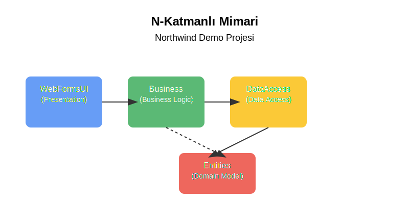

# N-Katmanlı Mimari Demo Projesi

Bu proje, N-Katmanlı mimari kullanılarak geliştirilmiş bir .NET uygulamasıdır. Northwind veritabanını kullanarak ürün yönetimi işlemlerini gerçekleştirir.

## Proje Yapısı

Proje aşağıdaki katmanlardan oluşmaktadır:

- **Northwind.Entities**: Veritabanı nesnelerini temsil eden entity sınıflarını içerir.
- **Northwind.DataAccess**: Veritabanı işlemlerini gerçekleştiren veri erişim katmanı.
- **Northwind.Business**: İş mantığı kurallarını içeren iş katmanı.
- **Northwind.WebFormsUI**: Kullanıcı arayüzü katmanı.

## Gereksinimler

- Visual Studio 2019 veya daha yeni bir sürüm
- .NET Framework 4.7.2 veya daha yeni bir sürüm
- SQL Server 2014 veya daha yeni bir sürüm
- Northwind veritabanı

## Kurulum Adımları

### 1. Projeyi İndirme ve Açma

1. Projeyi bilgisayarınıza indirin veya klonlayın.
2. Visual Studio'yu açın.
3. `NLayeredAppDemo.sln` dosyasını açın.

### 2. NuGet Paketlerini Yükleme

1. Visual Studio'da Çözüm Gezgini'nde çözüme sağ tıklayın.
2. "NuGet Paketlerini Geri Yükle" seçeneğini tıklayın.
3. Tüm paketlerin başarıyla yüklendiğinden emin olun.

### 3. Northwind Veritabanını Kurma

1. SQL Server Management Studio'yu açın.
2. Northwind veritabanını oluşturmak için aşağıdaki adımları izleyin:
   - Microsoft'un resmi [Northwind ve pubs örnek veritabanları](https://github.com/microsoft/sql-server-samples/tree/master/samples/databases/northwind-pubs) sayfasından Northwind script'ini indirin.
   - SQL Server Management Studio'da script'i çalıştırın.

### 4. Veritabanı Bağlantısını Yapılandırma

1. `Northwind.DataAccess` projesindeki `App.config` dosyasını açın.
2. ConnectionString değerini kendi SQL Server bağlantı bilgilerinize göre güncelleyin:

```xml
<connectionStrings>
  <add name="NorthwindContext" 
       connectionString="Data Source=(localdb)\MSSQLLocalDB;Initial Catalog=Northwind;Integrated Security=True" 
       providerName="System.Data.SqlClient" />
</connectionStrings>
```

### 5. Projeyi Çalıştırma

1. Visual Studio'da `Northwind.WebFormsUI` projesini başlangıç projesi olarak ayarlayın.
2. F5 tuşuna basarak veya "Başlat" düğmesine tıklayarak projeyi çalıştırın.

## Proje Mimarisi



Proje, yukarıdaki şemada gösterildiği gibi dört ana katmandan oluşmaktadır:
- **WebFormsUI**: Kullanıcı arayüzü katmanı
- **Business**: İş mantığı katmanı
- **DataAccess**: Veri erişim katmanı
- **Entities**: Veri nesneleri katmanı

## Notlar

- Bu proje eğitim amaçlıdır ve N-Katmanlı mimari prensiplerini göstermek için tasarlanmıştır.
- Gerçek projelerde daha kapsamlı hata yönetimi, loglama ve güvenlik önlemleri eklenmelidir.